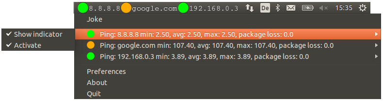
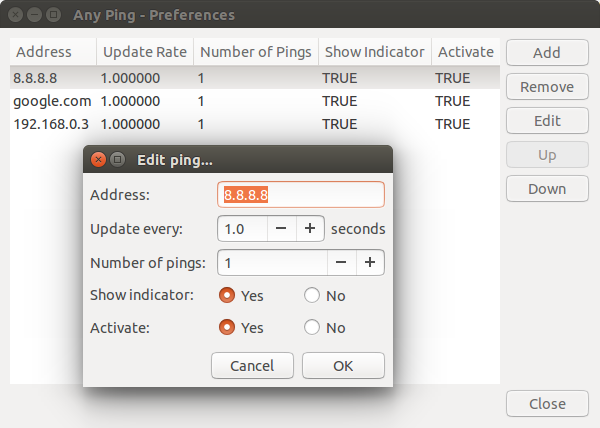

# Any Ping Indicator

**Author: Samuel Bachmann**





## Dependencies

- [svgutils](https://github.com/btel/svg_utils)

        sudo apt-get install libxml2-dev libxslt-dev python-virtualenv
        
        sudo pip install git+https://github.com/btel/svg_utils.git

## Install

```
make
sudo make install
```

## #Uninstall

```
sudo make uninstall
```
